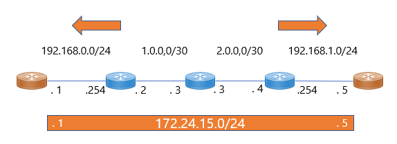

# IPsec_NAT-T_Example

## Goal

* 左からR1, R2, ..., R5とし、R1とR5のEnd-EndでIPsec Tunnelを確立する。
* R2 == R3 == R4は Internet区間
* R1 == R2 および R4 == R5 はLAN区間
* R2とR4でNAPTを適用。
* NATを経由するIPsecはNAT Traversalとなることに注意する。
  * https://www.infraexpert.com/study/ipsec15.html

## Configs
* R2とR4でのNATにてポートフォワーディング設定を適用する。
* 500と4500両方をフォワーディングすることでIPsec tunnelが確立する。
```
R2: 
ip nat inside source static udp 192.168.0.1 500 1.0.0.2 500 extendable
ip nat inside source static udp 192.168.0.1 4500 1.0.0.2 4500 extendable

R4:
ip nat inside source static udp 192.168.1.5 500 2.0.0.4 500 extendable
ip nat inside source static udp 192.168.1.5 4500 2.0.0.4 4500 extendable
```

## Results
* Cisco ルータの場合、IPsec tunnelが upして確立を確認可能
```
R1#show ip int brie
Interface                  IP-Address      OK? Method Status                Protocol
FastEthernet0/0            unassigned      YES unset  administratively down down
FastEthernet0/1            192.168.0.1     YES manual up                    up  
Tunnel15                   172.24.15.1     YES manual up                    up  

R1#ping 172.24.15.5
Type escape sequence to abort.
Sending 5, 100-byte ICMP Echos to 172.24.15.5, timeout is 2 seconds:
!!!!!
Success rate is 100 percent (5/5), round-trip min/avg/max = 108/122/144 ms
```
* NAT変換もされてることを確認
```
R2#show ip nat translations
Pro Inside global      Inside local       Outside local      Outside global
udp 1.0.0.2:500        192.168.0.1:500    2.0.0.4:500        2.0.0.4:500
udp 1.0.0.2:500        192.168.0.1:500    ---                ---
udp 1.0.0.2:4500       192.168.0.1:4500   2.0.0.4:4500       2.0.0.4:4500
udp 1.0.0.2:4500       192.168.0.1:4500   ---                ---
```

